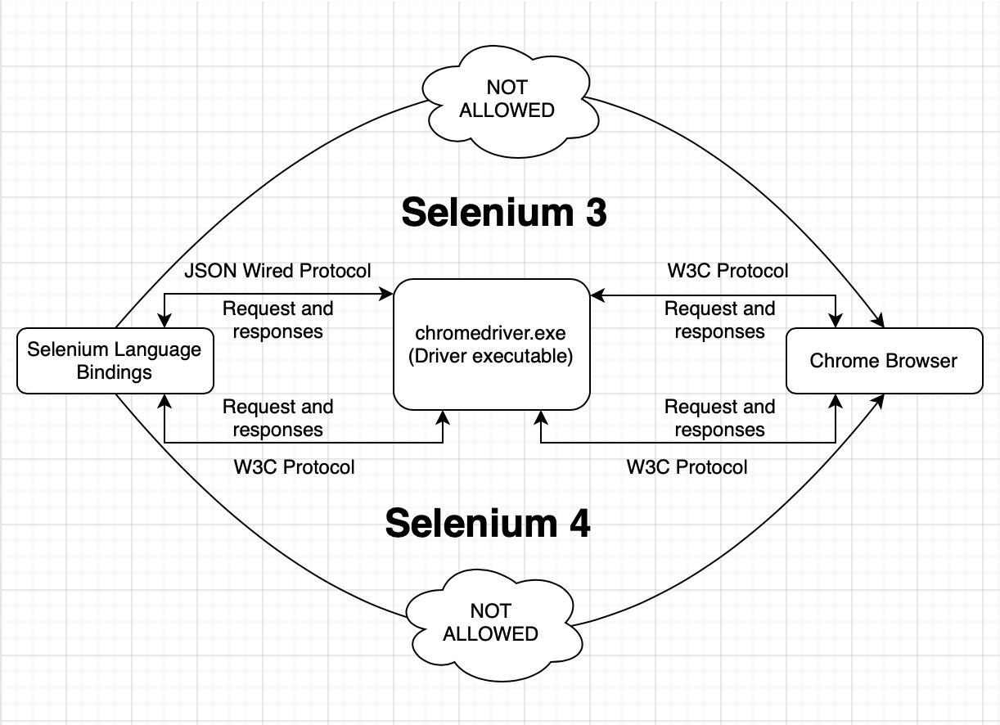
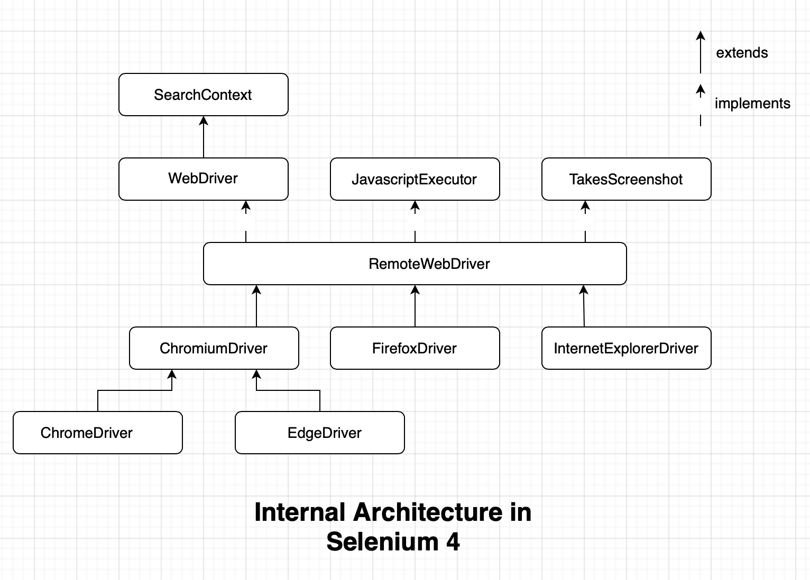
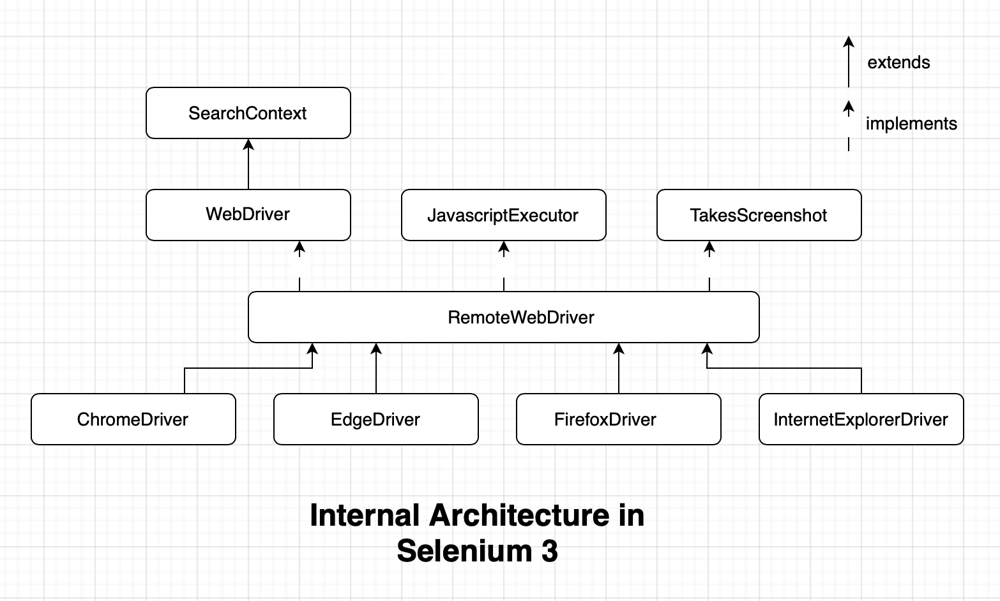
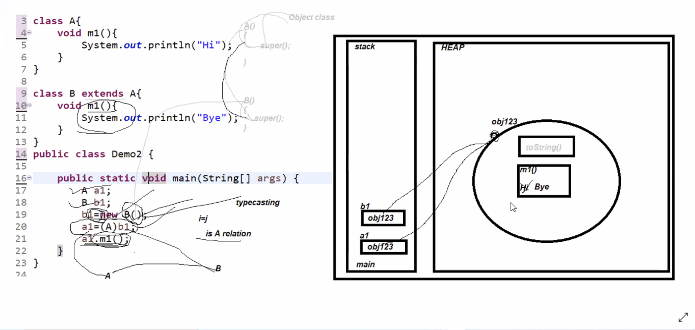
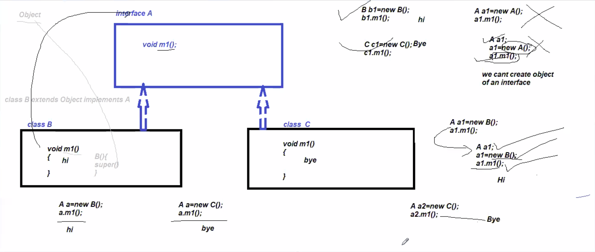

# NOTES - Test Automation with Selenium WebDriver

## Selenium Syllabus

- Automation Testing
  - What is Automation Testing?
  - When we Switch to Automation Testing?
  - Why Automation testing?
  - Advantages &  Disadvantages
  - Automation Testing Tools

- Selenium
  - What is Selenium?
  - Advantages of Selenium
  - Java-Selenium Architecture
  - Basic Selenium Program
  - Runtime Polymorphism Program in Selenium
  - WebDriver Functions
  - Locators
  - XPath, its types and cases
  - WebElement Functions
  - Check points
  - Handling Multiple Elements
  - Handling Synchronization
  - Implicit
  - Explicit
  - Custom wait
  - Blind wait
  - Handling Dropdown (static and dynamic)
  - Handling Keyboard and Mouse Actions
  - Taking Screenshot
  - Handling Disabled Element
  - Performing Scroll down Action
  - Handling Popups (web-based and Window-based)
  - Handling Frames
  - Handling New Windows/New Tabs
  - Encapsulation in Selenium
  - Creating Test Class

- Automation Framework
  - Stages and Types of Framework
  - POM (Page Object Model)
  - Handling Excel
  - TestNG
  - TestNG Annotations
  - Reporting
  - TestNG Suite
  - Assertion
  - Grouping
  - DataProvider
  - Parallel Execution
  - Maven
  - GitHub
  - Jenkins
  - Hybrid Framework
  - Designing Framework
  - Hybrid Framework Architecture
  - Framework implementation
  - Framework execution

## Brief Overview of Java Fundamentals

- Object Oriented Programming Fundamentals
  - Class: A blueprint
  - Object: Used to create multiple copies of the blueprint
  - Method: A block of code which performs a particular task
    - Static: Part of the class, common/shared copy accessible by all instances
    - Non-static: Part of the object, single copy accessible by each object of the class
  - Inheritance: Receiving properties from ancestor/parent class to child class
  - Abstraction: Disclosing only the important details, hiding internal implementation (e.g. we just type on a keyboard and don't know how internally the letter 'A' appears on screen)
  - Polymorphism: Behavior changes based on the situation (e.g. car can be used to take people from one place to another, it can also be used to take goods and furniture one place to another)
    - Compile-time Polymorphism: Method Overloading, binding of method call and the method body at the compile-time
    - Runtime polymorphism: Method Overriding, binding of method call and the method body at the run-time
- Data-types (int, float, double etc which can store single piece of data; arrays which can store multiple pieces of information but with a limitation that size of it can't be altered and it allows to store only one type of data/homogenous data)
- Collections
  - List
  - Set
  - Queue
  - Map
- String: Its a class, it's objects are immutable in nature

## Introduction to Selenium

### What is Automation?

Automation is performing any task using any system or tool without any manual intervention.

### Why do we need automation?

Software Development Life Cycle (SDLC) is a process or methodology used by the software industry to design, develop and test high quality softwares. The SDLC aims to produce a high-quality software that meets or exceeds customer expectations, reaches completion within times and cost estimates. It follows the following phases:
  
- Software Development Life Cycle (SDLC)
  - Requirement Gathering
  - Feasibility Study (Understand whether the given requirement can be built or not)
  - Design
    - High Level Design
    - Low Level Design
  - Testing
    - Software Test Life Cycle (STLC)
  - Deployment
  - Support & Maintenance

- Software Test Life Cycle (STLC)
  - System Study (Understand the behavior of the application)
  - Test Plan
  - Test Cases -> Test case life cycle, Traceability matrix etc.
  - Test Execution -> Test environment, Test data etc.
  - Defect Life Cycle
  - Reporting
  - Retrospect Meeting

- Test Cases
  - Functional Test cases
    - Integration test cases
    - System test cases
  - Non-functional test cases
    - Performance test cases
    - Security test cases
    - Usability test cases

__Note:__ Requirement Gathering is not a part of STLC because at the start of SDLC requirement is already been gathered. Feasibility Study is also not a part of STLC because anything on this earth can be tested as long as we have everything (test environment, test data etc) in place.

__Note:__ With selenium we can only automate the functional test cases

- When developer can share a new build because of following reasons
  - Bug fix
  - Addition of new requirement/feature
  - Modification of new requirement/feature
  - Deletion of new requirement/feature
- When testing team receives the new build, testing team should retest the given build, which is also known as regression testing. Repetitively testing the same features again and again is known as regression testing. Disadvantages of regression testing is:
  - Cost taking process, need more money
  - Effort taking process, need more man power and expertise
  - Chances of making mistakes are involved
  - Testing process might delay the deployment or release dates
- Because of the above reasons we go for automating the regression testing process, as we have to test the same test cases again and again numerous times if there comes any addition, update, deletion or fix in an existing feature/module. There are certain disadvantages of automation as well:
  - A completely new/unstable feature can't be automated
  - Certain features that involves in OTP generation, captcha etc. can't be automated
  - Automation requires more expertise professionals for converting the functional test cases into automation scripts
  - Success of all automation test cases can't guarantee 100% bug free product
  - Maintenance of the automated test cases from time to time is an extra overhead

### What is Selenium?

- Selenium is a free and open source web application automation tool.
- Free: Need not to pay for the license [https://www.selenium.dev/downlods]. We can use it to automate an application, we can use it for teaching purpose, we can use selenium give services to anyone an can take money out of him without paying back to the selenium community.
- Open source: We can see the source code, we can download the source code, we can customize the source code (e.g. Unix, Java, Android etc.), integration with third party tools will be very very easy (Maven, Git, Jenkins etc.)

### Features of Selenium

- An automation tool.
- It is a package/API.
- It is open-source.
- Used to automate Web applications that runs on a browser.
- Supports multiple languages - Java, Python, C#, JavaScript, Ruby, PHP etc. [Note: there is no dependency between the development language and the automation language, the application can be developed in React, Angular but it can be automated using Java-Selenium. But if you use the language with which the application is built, then the advantage is development and testing environments will be similar and chances are there that you may get some help from the development team].
  - More number of test engineers can be hired.
  - Transition from one language to another can be smooth (A person who knows Java-Selenium, can easily learn Python-Selenium).
- Entire code of selenium is written in Java, as its platform independent.
  - Hence we can indirectly say that Selenium runs on all the operating systems and browsers (wherever support is added) and so it's easy for doing compatibility testing (cross browser and cross platform testing).
  - Hence it's cost effective (e.g. QTP's license cost money + Windows OS license also costs money, whereas Selenium and linux can be used totally free of cost).
- Limitation of Selenium is it can be used only to automate Web Applications (standalone applications like Calculator, desktop applications like Microsoft Word/Excel/Powerpoint, mobile applications like Instagram and client/server applications like Zoom can't be automated).

### Installation of Selenium

__Requirements:__

- JDK (v 1.8 or above) [https://www.oracle.com/java/technologies/downloads/]
- JDK should be installed and path should be added in System Environment Variables (Windows)
- JDK should be installed and path should be added in .bashrc or .zshrc file present in home directory (Linux/Mac)
- To check proper installation of JDK enter commands `javac -version` and `java -version`
- Eclipse (or any IDE that supports Java e.g. IntelliJ/NetBeans) [https://www.eclipse.org/downloads/packages/]
- Selenium JAR file [https://www.selenium.dev/downloads/]. Previous releases can be found in [https://github.com/SeleniumHQ/selenium/releases]
- Driver executable for different browsers [https://www.selenium.dev/downloads/]
- Browsers in which you want to automate the web applications

__Installation:__

- Create a Java Project
- Create a directory under the Java Project and give it a name (Steps: Java Project -> `New` -> `Folder` -> Specify the name, for example 'lib' -> `Finish`)
- Copy the Selenium JAR file and paste it in 'lib' directory
- Right click on the Selenium JAR file present in 'lib' directory -> `Build Path` -> `Add to Build Path` (Selenium JAR file should also be displayed under `Referenced Libraries`)
- Write a sample Java code as shown below and run it (Note: Running this code will throw an exception - IllegalStateException)

  ```java
  public class Demo1 {
      public static void main(String[] args) {
          ChromeDriver driver = new ChromeDriver();
      }
  }
  ```

- Download the driver executable for the browser you want to automate from the link given above. Extract the zip file to get the executable file e.g. chromedriver.exe, geckodriver.exe etc.
- Create a folder 'driver' under the Java Project -> Copy and paste the driver executable file into this 'driver' directory.
- Then complete writing rest of the code as shown below:

  ```java
  // Opening Google in Chrome browser
  package com.aksharatraining.selenium.c01.basics;

  import org.openqa.selenium.chrome.ChromeDriver;

  public class P01_LaunchChromeBrowser {
      
      public static void main(String[] args) {
          String key = "webdriver.chrome.driver";
          String value = "./driver/chromedriver";
          System.setProperty(key, value);
          
          // Launch Google Chrome browser window
          ChromeDriver driver = new ChromeDriver();
      }
  }
  ```

  ```log
  Starting ChromeDriver 97.0.4692.71 (adefa7837d02a07a604c1e6eff0b3a09422ab88d-refs/branch-heads/4692@{#1247}) on port 50449
  Only local connections are allowed.
  Please see https://chromedriver.chromium.org/security-considerations for suggestions on keeping ChromeDriver safe.
  ChromeDriver was started successfully.
  Feb 03, 2022 2:43:50 AM org.openqa.selenium.remote.ProtocolHandshake createSession
  INFO: Detected dialect: W3C
  Feb 03, 2022 2:43:50 AM org.openqa.selenium.devtools.CdpVersionFinder findNearestMatch
  WARNING: Unable to find an exact match for CDP version 97, so returning the closest version found: 96
  Feb 03, 2022 2:43:50 AM org.openqa.selenium.devtools.CdpVersionFinder findNearestMatch
  INFO: Found CDP implementation for version 97 of 96
  ```

  ```java
  // Opening Google in Chrome browser with static block
  package com.aksharatraining.selenium.c01.basics;

  import org.openqa.selenium.chrome.ChromeDriver;

  public class P02_LaunchChomeBrowserWithStaticBlock {
      
      static {
          System.setProperty("webdriver.chrome.driver", "./driver/chromedriver");
      }
      
      public static void main(String[] args) {
          // Launch Google Chrome browser window
          ChromeDriver driver = new ChromeDriver();
          
          // Enter the URL 'https://www.google.com' in the search bar
          driver.get("https://www.google.com");
      }
  }
  ```

  ```log
  Starting ChromeDriver 97.0.4692.71 (adefa7837d02a07a604c1e6eff0b3a09422ab88d-refs/branch-heads/4692@{#1247}) on port 50449
  Only local connections are allowed.
  Please see https://chromedriver.chromium.org/security-considerations for suggestions on keeping ChromeDriver safe.
  ChromeDriver was started successfully.
  Feb 03, 2022 2:43:50 AM org.openqa.selenium.remote.ProtocolHandshake createSession
  INFO: Detected dialect: W3C
  Feb 03, 2022 2:43:50 AM org.openqa.selenium.devtools.CdpVersionFinder findNearestMatch
  WARNING: Unable to find an exact match for CDP version 97, so returning the closest version found: 96
  Feb 03, 2022 2:43:50 AM org.openqa.selenium.devtools.CdpVersionFinder findNearestMatch
  INFO: Found CDP implementation for version 97 of 96
  ```

  ```java
  // Opening Google in Firefox browser
  package com.aksharatraining.selenium.c01.basics;

  import org.openqa.selenium.firefox.FirefoxDriver;

  public class P03_LaunchFirefoxBrowser {
      
      static {
          System.setProperty("webdriver.gecko.driver", "./driver/geckodriver");
      }
      
      public static void main(String[] args) {
          // Launch Firefox browser window
          FirefoxDriver driver = new FirefoxDriver();
          
          // Enter the URL 'https://www.google.com' in the search bar
          driver.get("https://www.google.com");
      }
  }
  ```

  ```log
  1643836666166	geckodriver	INFO	Listening on 127.0.0.1:52780
  1643836667037	mozrunner::runner	INFO	Running command: "/Applications/Firefox.app/Contents/MacOS/firefox-bin" "--marionette" "--remote-debugging-port" "54315" "-foreground" "-no-remote" "-profile" "/var/folders/mq/9k9zz53d7sg8d2jthfvp2skckx697z/T/rust_mozprofiledcvEBp"
  1643836668096	Marionette	INFO	Marionette enabled
  2022-02-03 02:47:49.163 firefox-bin[64767:1491881] Warning: Expected min height of view: (<NSButton: 0x12c352c00>) to be less than or equal to 30 but got a height of 32.000000. This error will be logged once per view in violation.
  2022-02-03 02:47:49.164 firefox-bin[64767:1491881] Warning: Expected min height of view: (<NSButton: 0x1381ea000>) to be less than or equal to 30 but got a height of 32.000000. This error will be logged once per view in violation.
  2022-02-03 02:47:49.165 firefox-bin[64767:1491881] Warning: Expected min height of view: (<NSButton: 0x1381e8c00>) to be less than or equal to 30 but got a height of 32.000000. This error will be logged once per view in violation.
  2022-02-03 02:47:49.165 firefox-bin[64767:1491881] Warning: Expected min height of view: (<NSButton: 0x1381ec800>) to be less than or equal to 30 but got a height of 32.000000. This error will be logged once per view in violation.
  2022-02-03 02:47:49.166 firefox-bin[64767:1491881] Warning: Expected min height of view: (<NSButton: 0x1381ef400>) to be less than or equal to 30 but got a height of 32.000000. This error will be logged once per view in violation.
  2022-02-03 02:47:49.166 firefox-bin[64767:1491881] Warning: Expected min height of view: (<NSPopoverTouchBarItemButton: 0x1381eac00>) to be less than or equal to 30 but got a height of 32.000000. This error will be logged once per view in violation.
  2022-02-03 02:47:49.167 firefox-bin[64767:1491881] Warning: Expected min height of view: (<NSPopoverTouchBarItemButton: 0x13854d400>) to be less than or equal to 30 but got a height of 32.000000. This error will be logged once per view in violation.
  console.warn: SearchSettings: "get: No settings file exists, new profile?" (new NotFoundError("Could not open the file at /var/folders/mq/9k9zz53d7sg8d2jthfvp2skckx697z/T/rust_mozprofiledcvEBp/search.json.mozlz4", (void 0)))
  console.error: BackgroundUpdate: 
  _reasonsToNotScheduleUpdates: Failed to check for Maintenance Service Registry Key: [Exception... "Component returned failure code: 0x80004001 (NS_ERROR_NOT_IMPLEMENTED) [nsIUpdateProcessor.getServiceRegKeyExists]"  nsresult: "0x80004001 (NS_ERROR_NOT_IMPLEMENTED)"  location: "JS frame :: resource://gre/modules/BackgroundUpdate.jsm :: _reasonsToNotScheduleUpdates :: line 243"  data: no]
  DevTools listening on ws://localhost:54315/devtools/browser/f1e42209-857c-4c53-8857-9d72902770a2
  1643836670265	Marionette	INFO	Listening on port 62687
  1643836670339	RemoteAgent	WARN	TLS certificate errors will be ignored for this session
  Feb 03, 2022 2:47:50 AM org.openqa.selenium.remote.ProtocolHandshake createSession
  INFO: Detected dialect: W3C
  ```

__Note:__

- Take a screenshot of the entire window `PrintScrn` (Windows)
- To capture your entire screen and automatically save the Screenshots folder, tap the `Windows + PrintScrn` key. Your screen will briefly go dim to indicate that you've just taken a screenshot, and the screenshot will be saved to the Pictures > Screenshots folder.
- Take a screenshot of a small part of the window `Windows + Shift + S` (Windows)
- Take a screenshot of the entire window `Command + Shift + 3` (Mac)
- Take a screenshot of a small part of the window `Command + Shift + 4` (Mac)
- IDE stands for Integrated Development Environment which is a place for all development activity, where we can write code, compile code, run code, debug our code and if needed we can also push it to version control systems like GitHub, BitBucket etc.
- To call methods of a class, or create the object of a class present in different package we either need to import the class or use fully qualified class name.
- Specifying a class name including its package name is known as fully qualified class name (e.g. java.util.Scanner, where Scanner is the classname and java.util is the package name inside which this class is available)
- For security reasons browser can't allow anyone to write any code using any programming language and directly run it on the browser. Because chances are there they can easily hack the browser and the web application injecting malware, trojan or virus. Hence, they came up with a middle man, that is, driver executable. One of the driver executable is 'chromedriver.exe' which is developed by people working for Selenium and Google Chrome. Now, sending the request from Selenium to browser directly (which will create a security issue), Selenium will send a request to driver executable and driver executable will send the request to Chrome browser. Browser will trust the request of 'chromedriver.exe' because it's also developed by Google Chrome people. Once the request is processed Chrome browser will send the response to driver executable, driver executable will convert the response to selenium understandable format and will send it back to Selenium.
- Driver executables are vendor specific, that means, Google Chrome, Firefox, Opera, Safari, Internet Explorer, Edge etc all of them have their very own driver executables to communicate with their browser.
- In previous versions of Selenium (< v4.0) the communication between Selenium and the driver executable used to happen using JSON wired protocol and communication between driver executable and browser used to happen using W3C (World Wide Web Consortium) protocol.
  
  `Selenium` <--(_JSON Wired Protocol_)--> `Driver Executable` <--(_W3C Protocol_)--> `Browser`
  
  But, in Selenium v4.0 onwards the complete communication between Selenium, driver executable and browser, takes place using W3C (World Wide Web Consortium) protocol.

  `Selenium` <--(_W3C Protocol_)--> `Driver Executable` <--(_W3C Protocol_)--> `Browser`
  
- Diagram:


- Earlier there was a lot of delay in converting request and responses from one protocol to another (JSON Wired to W3C and W3C to JSON Wired). Now because in both the places W3C protocol is being used so the time consumption is less, performance is improved and test-cases in turn will have more stability.
- Inside the constructor call new ChromeDriver() Selenium people has written a code to search for the path of driver executable. Hence you need to provide the path of the driver executable either in the PATH environment variable of the system, or programmatically within the program by using `System.setProperty(key, value);`. Selenium will first search for the driver executable path in PATH environment variable, then it will search in the value of the key (e.g. webdriver.chrome.driver) in `System.setProperty(key, value);`, even then if it is not found finally it will throw IllegalStateException.
- Manually setting the driver executable path by going to the 'System Environment Variable' is always discouraged, because this way every other test engineer working in team has to follow the same way and chances are there that a newcomer may miss-out on doing this additional configuration - as a result program may start failing in his/her system. Hence, we should always set the driver executable path programmatically and keep the driver executable file inside the project.
- One more thing to remember is we should always use relative path of the driver executable while setting it up programmatically using `System.setProperty(key, value);`. Because, even if we are keeping the driver executable within the project, path of the driver executable may vary from one system to another if we use absolute path of the driver.
- Key present in `System.setProperty(key, value);` is case-sensitive and varies from one browser to another. For example, key for Chrome browser is 'webdriver.chrome.driver' and key for Firefox browser is 'webdriver.gecko.driver'
- We should always set the path of the driver executable before opening the browser, that is, before `new ChomeDriver()` constructor call. Best practice is to define the path of the driver executable programmatically within the static block, because static block is executed as soon as the class gets loaded.
- Any program that we want to run once and as soon as the class gets loaded, we may put that in static block. The static blocks are best used for initialization of static final variables (especially when the initialization requires a complicated computation which may occupy multiple lines of code).

  ```java
  public class Demo2 {
      static final int i;
      static {
          int j = 0;
          for (int p = 0; p < 10; p++)
              j = p + j;

          i = j;
      }

      public static void main(String[] args) {
          System.out.println(i);
      }
  }
  ```

- Static block may or may not get executed before the main() method, it all depends on the situation. An example where one static block gets executed before the main() method and another static block gets executed after the execution of main() method is given below:

  ```java
  class P {
      static {
          System.out.println("Static");
      }
  }

  public static A {
      // Because the main() method is present inside class A, hence class A will be loaded first
      static {
          System.out.println("Main static");
      }

      public static void main(String[] args) {
          System.out.println("Main");
          P p1 = new P();
      }
  }
  ```

  ```log
  Main static
  Main
  Static
  ```

## Internal Architecture of Selenium WebDriver

- Selenium is open-source, that means, anyone can see the source code, download it and customize it according to their need.
- We can see the source code of Selenium 4 visiting the URL: [https://github.com/SeleniumHQ/selenium]
- We can see the source code of Selenium 3 visiting the URL: [https://github.com/SeleniumHQ/selenium/tree/selenium-3.141.59]
- Super most interface is SearchContent and most frequently used interface is WebDriver.
- Diagram-1:

- Diagram-2:


## Runtime Polymorphism and Compatibility Testing

### Runtime Polymorphism in Java

- Example of Runtime polymorphism is shown below:

  ```java
  // Example 1: Runtime polymorphism
  class A {
      void m1() {
          System.out.println("Hi");
      }
  }

  class B extends A {
      void m1() {
          System.out.println("Bye");
      }
  }

  public class Demo2 {
      public static void main(String[] args) {
          A a1 = new A();
          a1.m1();

          B b1 = new B();
          b1.m1();

          // Runtime polymorphism
          A a2;
          B b2;
          b2 = new B();
          // a2 = (A) b1;
          a2 = b1;            // Auto-upcasting
          a2.m1();
      }
  }
  ```

  ```log
  Hi
  Bye
  Bye
  ```

  ```java
  // Example 1: Runtime polymorphism
  interface A {
      void m1();
  }

  class B implements A {
      public void m1() {
          System.out.println("m1() of B");
      }
  }

  class C implements A {
      public void m1() {
          System.out.println("m1() of C");
      }
  }

  public class Demo2 {
      public static void test(A a1) {
          // In this case prediction of output is not possible
          // Output depends on the object we pass and based on that JVM will link the method call statement with the method definition during runtime
          a1.m1();
      }

      public static void main(String[] args) {
          Demo2.test(new B());        // m1() of B

          Demo2.test(new C());        // m1() of C
      }
  }
  ```

  ```log
  m1() of B
  m1() of C
  ```

- Diagram-1:

- Diagram-2:


__Note:__

- In Java we have two types of memory - stack and heap. Stack is used for execution, heap is used for storage and for every thread one stack is created.
- Compiler will write a constructor for us if there is no constructor that is known as default constructor. Default constructor is always no argument constructor. Whenever any class is extending another class compiler will add super() call statement inside the child class constructor - which will load non-static members of the parent class.
- Loading of all non-static properties and methods into the object will start from top to bottom, i.e. parent class's members will be loaded in memory first then the properties of the child class will be loaded (class Object -> class A -> class B). Hence in the above example, a2.m1() will call the method m1() which is overridden in the object.
- For upcasting we should have IS-A relationship between two classes.
- The linking between the method calling statement to the method definition is done by the JVM during runtime time which is called as Runtime polymorphism.
- Method overriding is an example of Runtime polymorphism.
- 3 Things required for Runtime polymorphism: inheritance (IS-A relationship), overriding and upcasting.

### Compile-time Polymorphism in Java

- Example of Compile-time polymorphism is shown below:

  ```java
  class A {
      void m1() {
          System.out.println(0);
      }

      void m1(String s) {
          System.out.println(s);
      }
  }

  public class Demo1 {
      public static void test(A a1) {
          // Compile-time polymorphism: Compiler will link this m1() method call with first m1() method definition with no arguments
          a1.m1();
      }

      public static void main(String[] args) {
          test(new A());        // 0
      }
  }
  ```

  ```log
  0
  ```

__Note:__

- The linking between the method calling statement to the method definition is done by the compiler during compile time which is called as Compile-time polymorphism.
- Method overloading is an example of Compile-time polymorphism.

### Code Optimization Rules

- Example of code optimization is shown below:

  ```java
  // Example 1: Code optimization
  public class Demo3 {
      public static void main(String[] args) {
          /*
          // Without code optimization
          int i;
          int j;
          int k;
          i = 10;
          j = 20;

          k = i + j;
          System.out.println(k);
          */

          // Applying code optimization
          int i = 10;
          int j = 20;
          System.out.println(i + j);
      }
  }
  ```

  ```log
  30
  ```

  ```java
  // Example 2: Code optimization
  class P {
      static String test() {
          String name = "Bhanu";
          return name;
      }
  }

  public class Demo3 {
      public static void main(String[] args) {
          /*
          // Without code optimization
          String s = P.test();
          int l = s.length();
          System.out.println(l);
          */

          // Applying code optimization
          // length() method is present in the object returned by test() method (i.e. String class)
          // P.test().length(), calling a method like this one after another is called method chaining
          int l = P.test().length();
          System.out.println(l);
      }
  }
  ```

  ```log
  30
  ```

__Note:__

- Sometimes we need to reduce the number of lines of a code, this is possible using a concept called code optimization.
- We can merge two statements if:
  - There must be a common variable between those two statements.
  - For that common variable there must be assignment operator (=) in first statement.
  - In second statement we can replace the common variable with its RHS from first statement.
  - Finally we can delete the first statement.
- Advantage of code optimization is it will reduce the number of lines of code.
- Disadvantage of code optimization is it will reduce the reusability.
- In System.out.println(), out is the static reference variable present in System class through which we are calling the non-static method println() present in PrintStream class. That means, out reference variable is pointing to the object of PrintStream class and type of out is also PrintStream. This out reference variable has public static and final access and non-access modifiers.
- println() is the best example of method overloading.

### Use of Runtime Polymorphism in Selenium

- Example of Compatibility Testing in Selenium:

  ```java
  package com.aksharatraining.selenium.c01.basics;

  import org.openqa.selenium.WebDriver;
  import org.openqa.selenium.chrome.ChromeDriver;
  import org.openqa.selenium.firefox.FirefoxDriver;

  public class P04_CrossBrowserTestingUsingRTP {
      
      static {
          
          System.setProperty("webdriver.chrome.driver", "driver/chromedriver");
          System.setProperty("webdriver.gecko.driver", "driver/geckodriver");
      }
      
      // JVM will perform upcasting during runtime
      public static void testBrowser(WebDriver driver) {
          
          // Enter the URL
          driver.get("https://www.google.co.in");
          
          // Retrieve the title of the webpage and print it
          String title = driver.getTitle();
          System.out.println(driver instanceof ChromeDriver ? 
                  "Title from Chrome browser: " + title : 
                      "Title from Firefox browser: " + title);
          System.out.println();
          
          // Close the browser window
          // Based on the object we pass the respective close() method of the class will be invoked, hence this is an example of Runtime Polymorphism
          driver.close();
      }
      
      public static void main(String[] args) {
          
          P04_CrossBrowserTestingUsingRTP.testBrowser(new ChromeDriver());
          P04_CrossBrowserTestingUsingRTP.testBrowser(new FirefoxDriver());
      }
  }
  ```

  ```log
  Starting ChromeDriver 97.0.4692.71 (adefa7837d02a07a604c1e6eff0b3a09422ab88d-refs/branch-heads/4692@{#1247}) on port 64581
  Only local connections are allowed.
  Please see https://chromedriver.chromium.org/security-considerations for suggestions on keeping ChromeDriver safe.
  ChromeDriver was started successfully.
  Feb 03, 2022 3:07:17 AM org.openqa.selenium.remote.ProtocolHandshake createSession
  INFO: Detected dialect: W3C
  Feb 03, 2022 3:07:17 AM org.openqa.selenium.devtools.CdpVersionFinder findNearestMatch
  WARNING: Unable to find an exact match for CDP version 97, so returning the closest version found: 96
  Feb 03, 2022 3:07:17 AM org.openqa.selenium.devtools.CdpVersionFinder findNearestMatch
  INFO: Found CDP implementation for version 97 of 96
  Title from Chrome browser: Google

  1643837840338	geckodriver	INFO	Listening on 127.0.0.1:60407
  1643837841350	mozrunner::runner	INFO	Running command: "/Applications/Firefox.app/Contents/MacOS/firefox-bin" "--marionette" "--remote-debugging-port" "60337" "-foreground" "-no-remote" "-profile" "/var/folders/mq/9k9zz53d7sg8d2jthfvp2skckx697z/T/rust_mozprofile7RGfUz"
  1643837841737	Marionette	INFO	Marionette enabled
  2022-02-03 03:07:22.304 firefox-bin[65906:1504954] Warning: Expected min height of view: (<NSButton: 0x12d17d800>) to be less than or equal to 30 but got a height of 32.000000. This error will be logged once per view in violation.
  2022-02-03 03:07:22.304 firefox-bin[65906:1504954] Warning: Expected min height of view: (<NSButton: 0x137c73800>) to be less than or equal to 30 but got a height of 32.000000. This error will be logged once per view in violation.
  2022-02-03 03:07:22.305 firefox-bin[65906:1504954] Warning: Expected min height of view: (<NSButton: 0x137c6d400>) to be less than or equal to 30 but got a height of 32.000000. This error will be logged once per view in violation.
  2022-02-03 03:07:22.306 firefox-bin[65906:1504954] Warning: Expected min height of view: (<NSButton: 0x137c73c00>) to be less than or equal to 30 but got a height of 32.000000. This error will be logged once per view in violation.
  2022-02-03 03:07:22.306 firefox-bin[65906:1504954] Warning: Expected min height of view: (<NSButton: 0x137c74000>) to be less than or equal to 30 but got a height of 32.000000. This error will be logged once per view in violation.
  2022-02-03 03:07:22.307 firefox-bin[65906:1504954] Warning: Expected min height of view: (<NSPopoverTouchBarItemButton: 0x137c6d800>) to be less than or equal to 30 but got a height of 32.000000. This error will be logged once per view in violation.
  2022-02-03 03:07:22.307 firefox-bin[65906:1504954] Warning: Expected min height of view: (<NSPopoverTouchBarItemButton: 0x137ce7800>) to be less than or equal to 30 but got a height of 32.000000. This error will be logged once per view in violation.
  console.warn: SearchSettings: "get: No settings file exists, new profile?" (new NotFoundError("Could not open the file at /var/folders/mq/9k9zz53d7sg8d2jthfvp2skckx697z/T/rust_mozprofile7RGfUz/search.json.mozlz4", (void 0)))
  console.error: BackgroundUpdate: 
  _reasonsToNotScheduleUpdates: Failed to check for Maintenance Service Registry Key: [Exception... "Component returned failure code: 0x80004001 (NS_ERROR_NOT_IMPLEMENTED) [nsIUpdateProcessor.getServiceRegKeyExists]"  nsresult: "0x80004001 (NS_ERROR_NOT_IMPLEMENTED)"  location: "JS frame :: resource://gre/modules/BackgroundUpdate.jsm :: _reasonsToNotScheduleUpdates :: line 243"  data: no]
  DevTools listening on ws://localhost:60337/devtools/browser/5133c21c-8263-4e6b-b24c-85ef8d5414f1
  1643837843268	Marionette	INFO	Listening on port 63008
  1643837843323	RemoteAgent	WARN	TLS certificate errors will be ignored for this session
  Feb 03, 2022 3:07:23 AM org.openqa.selenium.remote.ProtocolHandshake createSession
  INFO: Detected dialect: W3C
  Title from Firefox browser: Google

  Feb 03, 2022 3:07:25 AM org.openqa.selenium.devtools.CdpVersionFinder findNearestMatch
  INFO: Found exact CDP implementation for version 85
  1643837845662	Marionette	INFO	Stopped listening on port 63008

  ###!!! [Parent][RunMessage] Error: Channel closing: too late to send/recv, messages will be lost
  ```

__Note:__

- As majority of the useful methods are present in WebDriver interface, so Selenium always recommends us to upcast the driver object to WebDriver interface.
- `public static void testBrowser(WebDriver driver) { ... }` is better than `public static void testBrowser(ChromeDriver driver) { ... }` because the first will work in any browser which has support for Selenium hence it will drastically increase the code reusability, but second one will only work for Chrome browser.
- Upcasting: Converting a child object to parent type, e.g. `WebDriver driver = new ChromeDriver();`. We use this so that same automation script works on any browser.

## Selenium Grid

### Installation and Requirements

1. Remote system (Node) requirements: An OS (Windows, Linux, Mac), Java/JRE, Browser, Driver Executables, selenium-server-4.x.x.jar.
2. Local system (Hub) requirements: An OS (Windows, Linux, Mac), JDK, Any IDE (Eclipse, IntelliJ etc.), Plugins like TestNG, JUnit etc.  
__Note:__ In standalone mode Hub and Node resides in the same system.
3. Create a folder 'Remote' in the remote system.
4. Copy paste selenium-server-4.x.x.jar file and driver executable files into it
5. Open 'Terminal' / 'Command Prompt' and go to the location where selenium-server-4.x.x.jar and driver executable files are present.
6. Run the following command to start up Selenium Grid in Standalone mode:  
`java -jar selenium-server-4.1.2.jar standalone --port 4444`
7. Once the above command is initiated the following message can be seen:  
`Started Selenium Standalone 4.1.2 (revision 9a5a329c5a): http://192.168.29.35:4444`
8. Open the browser and enter the URL (URL of the remote system where Selenium Grid is running) `http://192.168.29.35:4444` (In case you are running Selenium Grid on the same device you can also use `http://localhost:4444`). Selenium Grid page should be displayed.  
__Note:__ Deprecated URL for Selenium Grid in version 3.141.59 `http://192.168.29.35:4444/grid/console`]
9. Develop test script.
10. Run the test script on the URL where Selenium Grid is running using RemoteWebDriver class.

### Features of Selenium Grid

- Selenium Grid is used for distributed test automation in remote systems.
- 3 grid types are supported in Selenium 4:
  - Standalone Mode
  - Classical Grid (Hub and Node like earlier versions)
  - Fully Distributed (Router, Distributor, Session, and Node)
    - Router: Listens to the new session request.
    - Distributor: Selects the appropriate node where the test should be executed.
    - Session Map: Maps the session ID to the node.
    - Node: Test machine where the test execution takes place.
- URL to monitor sessions: `http://192.168.29.35:4444/status`
- URL to connect and execute test cases via RemoteWebDriver in Selenium 3: `http://localhost:4444/wd/hub`
- URL to connect and execute test cases via RemoteWebDriver in Selenium 4: `http://localhost:4444`
- Minimum command to run Selenium Grid in version 3:  
`java -jar selenium-server-standalone-3.141.59.jar`
- Minimum command to run Selenium Grid in version 4:  
`java -jar selenium-server-4.1.1.jar standalone`
- Command to run Selenium Grid as Hub in version 3:  
`java -jar selenium-server-standalone-3.141.59.jar -role hub`
- Command to run Selenium Grid as Hub in version 4:  
`java -jar selenium-server-4.1.1.jar hub`
- Command to run Selenium Grid as Node in version 3:  
`java -jar selenium-server-standalone-3.141.59.jar -role node -hub http://192.168.29.35:4444/grid/register/`
- Command to run Selenium Grid as Node in version 4 (Same system):  
`java -jar selenium-server-4.1.1.jar node --detect-drivers`
- Command to run Selenium Grid as Node in version 4 (Different system):  
`java -jar selenium-server-4.1.1.jar node --detect-drivers --publish-events tcp://192.168.29.35:4442 --subscribe-events tcp://192.168.29.35:4443`
- Max. concurrency in Selenium Grid by default: 12 (We may alter it)

### Detailed Explanation on Selenium Grid

- [LambdaTest - Selenium Grid 4](https://www.lambdatest.com/blog/selenium-grid-4-tutorial-for-distributed-testing/)
- [BrowserStack - Selenium Grid 4](https://www.browserstack.com/guide/selenium-grid-4-tutorial)
- [Codoid - Selenium Grid](https://codoid.com/selenium-testing/selenium-grid-tutorial/)
- [Selenium.dev - Official Documentation on Selenium Grid 4](https://www.selenium.dev/documentation/grid/)
- [DZone - Selenium Grid 4](https://dzone.com/articles/selenium-grid-4-tutorial-for-distributed-testing)

```java
// Example: Selenium Grid using DesiredCapabilities class
package com.aksharatraining;

import java.net.MalformedURLException;
import java.net.URL;

import org.openqa.selenium.Platform;
import org.openqa.selenium.WebDriver;
import org.openqa.selenium.remote.CapabilityType;
import org.openqa.selenium.remote.DesiredCapabilities;
import org.openqa.selenium.remote.RemoteWebDriver;
import org.testng.annotations.Test;

public class SeleniumGridUsingDC {

    @Test
    public void testA() throws InterruptedException, MalformedURLException {
        
        // Entering the URL of remote system
        // URL remoteAddress = new URL("http://localhost:4444");
        URL remoteAddress = new URL("http://192.168.29.35:4444");
        
        DesiredCapabilities capabilities = new DesiredCapabilities();
        // capabilities.setCapability(CapabilityType.BROWSER_NAME, "chrome");
        capabilities.setBrowserName("chrome");
        capabilities.setPlatform(Platform.ANY);                // Any OS
        // capabilities.setPlatform(Platform.BIG_SUR);         // MacOS 11.0
        // capabilities.setPlatform(Platform.MAC);             // Any MacOS
        // capabilities.setPlatform(Platform.LINUX);           // Linux OS (Ubuntu, Fedora, Linux Mint etc)
        // capabilities.setPlatform(Platform.VISTA);           // Windows 7
        // capabilities.setPlatform(Platform.WIN10);           // Windows 10
        
        // Note: Use of DesiredCapabilities class is deprecated from Selenium 4, hence use of browser Options classes are recommended
        WebDriver driver = new RemoteWebDriver(remoteAddress, capabilities);
        driver.get("https://demo.actitime.com/login.do");
    }
}
```

---

```java
// Example: Selenium Grid using browser Options classes
package com.aksharatraining;

import java.net.MalformedURLException;
import java.net.URL;

import org.openqa.selenium.By;
import org.openqa.selenium.Dimension;
import org.openqa.selenium.Point;
import org.openqa.selenium.WebDriver;
import org.openqa.selenium.chrome.ChromeOptions;
import org.openqa.selenium.firefox.FirefoxOptions;
import org.openqa.selenium.remote.RemoteWebDriver;
import org.testng.annotations.Optional;
import org.testng.annotations.Parameters;
import org.testng.annotations.Test;

// Note: Use of DesiredCapabilities class is deprecated from Selenium 4, hence use of browser Options classes are recommended
public class SeleniumGridUsingOptions {

    final String defaultUrl = "http://localhost:4444",
            defaultBrowser = "firefox",
            defaultCoordsX = "0";

    @Parameters({ "remoteUrl", "browser", "coordsX" })
    @Test
    public void testA(@Optional(defaultUrl) String remoteUrl,
            @Optional(defaultBrowser) String browser,
            @Optional(defaultCoordsX) String coordsX) throws InterruptedException, MalformedURLException {

        WebDriver driver = null;
        
        if (browser.equalsIgnoreCase("chrome")) {
            driver = new RemoteWebDriver(new URL(remoteUrl), new ChromeOptions());
        }
        else if (browser.equalsIgnoreCase("firefox")) {
            driver = new RemoteWebDriver(new URL(remoteUrl), new FirefoxOptions());
        }
        else {
            System.out.println("Browser is not supported");
            System.exit(0);
        }

        // Resize the browser window
        Dimension d = new Dimension(300, 600);
        driver.manage().window().setSize(d);

        // Alter the position of the browser window according the coordinates passed
        int x = Integer.parseInt(coordsX);
        Point p = new Point(x, 0);
        driver.manage().window().setPosition(p);

        driver.get("https://demo.actitime.com/login.do");

        for (int i = 1; i <= 10; i++) {
            driver.findElement(By.id("username")).sendKeys("admin");
            Thread.sleep(500);
            driver.findElement(By.id("username")).clear();
            Thread.sleep(500);
        }

        driver.close();
    }
}
```

```xml
<!DOCTYPE suite SYSTEM "https://testng.org/testng-1.0.dtd" >
<suite name="Suite" parallel="tests">
    <test name="TestGC">
        <parameter name="remoteURL" value="http://localhost:4444" />
        <parameter name="browser" value="chrome" />
        <parameter name="coordsX" value="0" />
        <classes>
            <class name="day33.SeleniumGridUsingOptions" />
        </classes>
    </test>
    <test name="TestFF">
        <parameter name="remoteURL" value="http://localhost:4444" />
        <parameter name="browser" value="firefox" />
        <parameter name="coordsX" value="600" />
        <classes>
            <class name="day33.SeleniumGridUsingOptions" />
        </classes>
    </test>
</suite>
```

### Running Automated Tests in SauceLabs

```java
// Example: Running automated selenium tests in parallel in SauceLabs
package com.aksharatraining;

import java.net.MalformedURLException;
import java.net.URL;
import java.time.Duration;
import java.util.HashMap;
import java.util.Map;

import org.openqa.selenium.By;
import org.openqa.selenium.Dimension;
import org.openqa.selenium.JavascriptExecutor;
import org.openqa.selenium.Point;
import org.openqa.selenium.WebDriver;
import org.openqa.selenium.chrome.ChromeOptions;
import org.openqa.selenium.firefox.FirefoxOptions;
import org.openqa.selenium.remote.AbstractDriverOptions;
import org.openqa.selenium.remote.RemoteWebDriver;
import org.openqa.selenium.support.locators.RelativeLocator;
import org.openqa.selenium.support.ui.ExpectedConditions;
import org.openqa.selenium.support.ui.WebDriverWait;
import org.testng.Assert;
import org.testng.ITestResult;
import org.testng.Reporter;
import org.testng.annotations.AfterClass;
import org.testng.annotations.AfterMethod;
import org.testng.annotations.BeforeMethod;
import org.testng.annotations.Optional;
import org.testng.annotations.Parameters;
import org.testng.annotations.Test;

public class RunningTestsInSauceLabs {
    
    WebDriver driver = null;
    AbstractDriverOptions<?> browserOptions = null;
    WebDriverWait wait = null;
    JavascriptExecutor jse = null;
    
    // Get username and access key for SauceLabs from 'Account' -> 'User Settings'
    // and set them as 'Environment Variables' for testng_day33_rtisaucelabs.xml
    // right click on testng_day33_rtisaucelabs.xml -> Run As -> Run Configurations -> Environment
    public static final String USERNAME = System.getenv("SAUCE_USERNAME");
    public static final String ACCESS_KEY = System.getenv("SAUCE_ACCESS_KEY");
    
    @Parameters({ "remoteUrl", "os", "browser", "browserVersion",  "coordsX" })
    @BeforeMethod
    public void setUp(@Optional("http://localhost:4444") String remoteUrl,
            @Optional("Windows 10") String os,
            @Optional("chrome") String browser,
            @Optional("latest") String browserVersion,
            @Optional("0") String coordsX) throws MalformedURLException {
        
        if (browser.equalsIgnoreCase("chrome")) {
            browserOptions = new ChromeOptions();
        }
        else if (browser.equalsIgnoreCase("firefox")) {
            browserOptions = new FirefoxOptions();
        }
        else {
            System.out.println("Browser is not supported");
            System.exit(0);
        }
        
        // To run the script in local/standalone system, comment the following lines
        // Platform configurator: https://saucelabs.com/platform/platform-configurator
        // -------- Comment Start --------
        browserOptions.setPlatformName(os);
        browserOptions.setBrowserVersion(browserVersion);
        
        // Default screen resolution for tests in SauceLabs is 1024x768
        Map<String, Object> sauceOptions = new HashMap<>();
        String testName = this.getClass().getSimpleName() + " - " + os + " - " + browser; 
        sauceOptions.put("username", USERNAME);
        sauceOptions.put("accessKey", ACCESS_KEY);
        sauceOptions.put("screenResolution", "1600x1200");
        sauceOptions.put("chromedriverVersion", "98.0.4758.102");
        sauceOptions.put("geckodriverVersion", "0.30.0");
        sauceOptions.put("seleniumVersion", "4.1.1");
        sauceOptions.put("name", testName);
        browserOptions.setCapability("sauce:options", sauceOptions);
        // -------- Comment End --------
        
        driver = new RemoteWebDriver(new URL(remoteUrl), browserOptions);
        wait = new WebDriverWait(driver, Duration.ofSeconds(10));
        jse = (JavascriptExecutor) driver;
        driver.manage().window().setSize(new Dimension(600, 900));
        driver.manage().window().setPosition(new Point(Integer.parseInt(coordsX), 0));
        driver.manage().timeouts().implicitlyWait(Duration.ofSeconds(10));
        driver.manage().timeouts().pageLoadTimeout(Duration.ofSeconds(15));
        driver.get("https://www.saucedemo.com");
    }
    
    @Test
    public void getSauceLabsBackpackPriceTest() throws InterruptedException {
        
        driver.findElement(By.id("user-name")).sendKeys("standard_user");
        driver.findElement(By.id("password")).sendKeys("secret_sauce");
        driver.findElement(By.id("login-button")).click();
        
        wait.until(ExpectedConditions.urlContains("inventory.html"));
        String actualPrice = "$29.99";
        String expectedPrice = driver.findElement(
                RelativeLocator.with(By.className("inventory_item_price"))
                    .below(By.xpath("//div[text()='Sauce Labs Backpack']"))).getText();
        
        Reporter.log("Cost of 'Sauce Labs Backpack': " + expectedPrice, true);
        Assert.assertEquals(actualPrice, expectedPrice);
        
        driver.findElement(By.id("react-burger-menu-btn")).click();
        Thread.sleep(1000);
        driver.findElement(By.id("logout_sidebar_link")).click();
    }
    
    @AfterMethod(alwaysRun = true)
    public void analyzeTest(ITestResult result) {
        String status = result.isSuccess() ? "passed" : "failed";
        jse.executeScript("sauce:job-result=" + status);
    }
    
    @AfterClass(alwaysRun = true)
    public void tearDown() {
        if (driver != null)
            driver.close();
    }
}
```

```xml
<!DOCTYPE suite SYSTEM "https://testng.org/testng-1.0.dtd">
<suite name="Suite" parallel="tests" thread-count="3">
    <test name="SauceLabs Test - Chrome">
        <parameter name="remoteUrl" value="https://ondemand.eu-central-1.saucelabs.com:443/wd/hub" />
        <parameter name="os" value="Windows 11" />
        <parameter name="browser" value="chrome" />
        <parameter name="browserVersion" value="98" />
        <parameter name="coordsX" value="0" />
        <classes>
            <class name="day33.RunningTestsInSauceLabs" />
        </classes>
    </test>
    <test name="SauceLabs Test - Firefox">
        <parameter name="remoteUrl" value="https://ondemand.eu-central-1.saucelabs.com:443/wd/hub" />
        <parameter name="os" value="macOS 12" />
        <parameter name="browser" value="firefox" />
        <parameter name="browserVersion" value="latest" />
        <parameter name="coordsX" value="800" />
        <classes>
            <class name="day33.RunningTestsInSauceLabs" />
        </classes>
    </test>
</suite>
```

### Running Automated Tests in BrowserStack

```java
// Example: Running automated selenium tests in BrowserStack
package com.aksharatraining;

import java.net.MalformedURLException;
import java.net.URL;
import java.time.Duration;
import java.util.HashMap;
import java.util.Map;

import org.openqa.selenium.By;
import org.openqa.selenium.Dimension;
import org.openqa.selenium.JavascriptExecutor;
import org.openqa.selenium.Point;
import org.openqa.selenium.WebDriver;
import org.openqa.selenium.chrome.ChromeOptions;
import org.openqa.selenium.firefox.FirefoxOptions;
import org.openqa.selenium.remote.AbstractDriverOptions;
import org.openqa.selenium.remote.RemoteWebDriver;
import org.openqa.selenium.support.locators.RelativeLocator;
import org.openqa.selenium.support.ui.ExpectedConditions;
import org.openqa.selenium.support.ui.WebDriverWait;
import org.testng.Assert;
import org.testng.Reporter;
import org.testng.annotations.AfterMethod;
import org.testng.annotations.BeforeMethod;
import org.testng.annotations.Optional;
import org.testng.annotations.Parameters;
import org.testng.annotations.Test;

public class RunningTestsInBrowserStack {

    WebDriver driver = null;
    AbstractDriverOptions<?> browserOptions = null;
    WebDriverWait wait = null;
    JavascriptExecutor jse = null;
    
    // Get username and access key for BrowserStack from 'Profile' icon -> 'Settings'
    // and set them as 'Environment Variables' for testng_day33_rtibrowserstack.xml
    // right click on testng_day33_rtibrowserstack.xml -> Run As -> Run Configurations -> Environment
    public static final String USERNAME = System.getenv("BROWSERSTACK_USERNAME");
    public static final String ACCESS_KEY = System.getenv("BROWSERSTACK_ACCESS_KEY");
    
    @Parameters({ "remoteUrl", "os", "osVersion", "browser", "browserVersion",  "coordsX" })
    @BeforeMethod
    public void setUp(@Optional("http://localhost:4444") String remoteUrl,
            @Optional("Windows") String os,
            @Optional("10") String osVersion,
            @Optional("Chrome") String browser,
            @Optional("latest") String browserVersion,
            @Optional("0") String coordsX) throws MalformedURLException {
        
        if (browser.equalsIgnoreCase("chrome")) {
            browserOptions = new ChromeOptions();
        }
        else if (browser.equalsIgnoreCase("firefox")) {
            browserOptions = new FirefoxOptions();
        }
        else {
            System.out.println("Browser is not supported");
            System.exit(0);
        }
        
        // To run the script in local/standalone system, comment the following lines
        // Platform configurator: https://www.browserstack.com/automate/capabilities?tag=selenium-4
        // -------- Comment Start --------
        browserOptions.setCapability("browserName", browser);
        browserOptions.setCapability("browserVersion", browserVersion);
        
        // Default screen resolution for tests in BrowserStack is 1980 x 1080
        Map<String, Object> browserstackOptions = new HashMap<String, Object>();
        String testName = this.getClass().getSimpleName() + " - " + os + " - " + browser; 
        browserstackOptions.put("userName", USERNAME);
        browserstackOptions.put("accessKey", ACCESS_KEY);
        browserstackOptions.put("os", os);
        browserstackOptions.put("osVersion", osVersion);
        browserstackOptions.put("projectName", "SeleniumWebDriverTutorials");
        browserstackOptions.put("sessionName", testName);
        browserstackOptions.put("buildName", "Build v0.5");
        // browserstackOptions.put("resolution", "1600x1200");
        // browserstackOptions.put("local", "false");          // Test localhost / internal servers in your network
        // browserstackOptions.put("debug", "true");           // Generate screenshots at various steps in your test
        // browserstackOptions.put("consoleLogs", "verbose");  // Capture browser console logs at various steps in your test
        // browserstackOptions.put("networkLogs", "true");     // Capture network logs for your test
        browserstackOptions.put("seleniumVersion", "4.1.2");
        browserOptions.setCapability("bstack:options", browserstackOptions);
        // -------- Comment End --------
        
        driver = new RemoteWebDriver(new URL(remoteUrl), browserOptions);
        wait = new WebDriverWait(driver, Duration.ofSeconds(10));
        jse = (JavascriptExecutor) driver;
        driver.manage().window().setSize(new Dimension(600, 900));
        driver.manage().window().setPosition(new Point(Integer.parseInt(coordsX), 0));
        driver.manage().timeouts().implicitlyWait(Duration.ofSeconds(10));
        driver.manage().timeouts().pageLoadTimeout(Duration.ofSeconds(15));
        driver.get("https://www.saucedemo.com");
    }
    
    @Test
    public void getSauceLabsBackpackPriceTest() {
        
        try {
            driver.findElement(By.id("user-name")).sendKeys("standard_user");
            driver.findElement(By.id("password")).sendKeys("secret_sauce");
            driver.findElement(By.id("login-button")).click();
            
            wait.until(ExpectedConditions.urlContains("inventory.html"));
            String actualPrice = "$29.99";
            String expectedPrice = driver.findElement(
                    RelativeLocator.with(By.className("inventory_item_price"))
                        .below(By.xpath("//div[text()='Sauce Labs Backpack']"))).getText();
            
            Reporter.log("Cost of 'Sauce Labs Backpack': " + expectedPrice, true);
            Assert.assertEquals(actualPrice, expectedPrice);
            // Setting the status of test as 'Passed' or 'Failed' on BrowserStack
            jse.executeScript("browserstack_executor: {\"action\": \"setSessionStatus\", \"arguments\": "
                    + "{\"status\": \"passed\", \"reason\": \"URL and cost matched!\"}}");
            
            driver.findElement(By.id("react-burger-menu-btn")).click();
            Thread.sleep(1000);
            driver.findElement(By.id("logout_sidebar_link")).click();
        } catch (Exception e) {
            String message = e.toString();
            jse.executeScript("browserstack_executor: {\"action\": \"setSessionStatus\", \"arguments\": "
                    + "{\"status\": \"failed\", \"reason\": \"" + message + "\"}}");
            Reporter.log(message, true);
            e.printStackTrace();
        }
    }
    
    @AfterMethod(alwaysRun = true)
    public void tearDown() {
        if (driver != null)
            driver.quit();
    }
}
```

```xml
<!DOCTYPE suite SYSTEM "https://testng.org/testng-1.0.dtd">
<suite name="Suite" parallel="tests" thread-count="3">
    <test name="BrowserStack Test - Chrome">
        <parameter name="remoteUrl" value="https://hub-cloud.browserstack.com/wd/hub" />
        <parameter name="os" value="Windows" />
        <parameter name="osVersion" value="11" />
        <parameter name="browser" value="Chrome" />
        <parameter name="browserVersion" value="98.0" />
        <parameter name="coordsX" value="0" />
        <classes>
            <class name="day33.RunningTestsInBrowserStack" />
        </classes>
    </test>
    <test name="BrowserStack Test - Firefox">
        <parameter name="remoteUrl" value="https://hub-cloud.browserstack.com/wd/hub" />
        <parameter name="os" value="OS X" />
        <parameter name="osVersion" value="Monterey" />
        <parameter name="browser" value="Firefox" />
        <parameter name="browserVersion" value="latest" />
        <parameter name="coordsX" value="800" />
        <classes>
            <class name="day33.RunningTestsInBrowserStack" />
        </classes>
    </test>
</suite>
```

__Note:__

- BrowserStack does not know when you are done with all the steps in your Selenium test.
- The driver.quit() Selenium command, helps us identify that all the steps of the Automate test are finished and the test is completed.
- You should call the driver.quit() command after all the steps in your test script.
- Alternate solution:
  - BrowserStack triggers the BROWSERSTACK_IDLE_TIMEOUT error when a session is left idle for more than 90 seconds.
  - The browserstack.idleTimeout capability helps you to change the timeout value in case the web page takes longer than 90 seconds to open.
  - You can set a timeout value from 0 to 300 seconds.
  - The default value is 90 seconds.
  - Code Snippet:

    ```java
    DesiredCapabilities caps = new DesiredCapabilities();
    caps.setCapability("browserstack.idleTimeout", "300");
    ```

## Generate and Monitor Browser Logs

### Minimal Logs

```java
// Example: Code to generate minimal browser logs based on the actions performed by Selenium
package com.aksharatraining.selenium.c01.basics;

import java.util.logging.Level;

import org.openqa.selenium.Keys;
import org.openqa.selenium.WebDriver;
import org.openqa.selenium.chrome.ChromeDriver;
import org.openqa.selenium.remote.RemoteWebDriver;

public class P05_EnableSeleniumBrowserLogs_M1 {
    
    static {
        System.setProperty("webdriver.chrome.driver", "driver/chromedriver");
    }
    
    public static void main(String[] args) throws InterruptedException {
        
        WebDriver driver = new ChromeDriver();
        ((RemoteWebDriver) driver).setLogLevel(Level.INFO);
        
        driver.get("http://www.google.com");
        driver.switchTo().activeElement().sendKeys("Akshara Training", Keys.ENTER);
        driver.close();
    }
}
```

```log
Starting ChromeDriver 98.0.4758.80 (7f0488e8ba0d8e019187c6325a16c29d9b7f4989-refs/branch-heads/4758@{#972}) on port 52578
Only local connections are allowed.
Please see https://chromedriver.chromium.org/security-considerations for suggestions on keeping ChromeDriver safe.
ChromeDriver was started successfully.
[1646778106.759][WARNING]: This version of ChromeDriver has not been tested with Chrome version 99.
Mar 09, 2022 3:51:46 AM org.openqa.selenium.remote.ProtocolHandshake createSession
INFO: Detected dialect: W3C
Mar 09, 2022 3:51:47 AM org.openqa.selenium.devtools.CdpVersionFinder findNearestMatch
WARNING: Unable to find an exact match for CDP version 99, so returning the closest version found: 97
Mar 09, 2022 3:51:47 AM org.openqa.selenium.devtools.CdpVersionFinder findNearestMatch
INFO: Found CDP implementation for version 99 of 97
Mar 09, 2022 3:51:47 AM org.openqa.selenium.remote.RemoteWebDriver log
INFO: Executing: get [ed533bdb319939a513f3fbd1a44b7ef7, get {url=http://www.google.com}]
Mar 09, 2022 3:51:49 AM org.openqa.selenium.remote.RemoteWebDriver log
INFO: Executed: (Response: SessionID: ed533bdb319939a513f3fbd1a44b7ef7, Status: 0, Value: null)
Mar 09, 2022 3:51:49 AM org.openqa.selenium.remote.RemoteWebDriver log
INFO: Executing: getActiveElement [ed533bdb319939a513f3fbd1a44b7ef7, getActiveElement {}]
Mar 09, 2022 3:51:49 AM org.openqa.selenium.remote.RemoteWebDriver log
INFO: Executed: (Response: SessionID: ed533bdb319939a513f3fbd1a44b7ef7, Status: 0, Value: {element-6066-11e4-a52e-4f735466cecf=1f01575f-cbb5-484d-b439-d392aa372ecb})
Mar 09, 2022 3:51:49 AM org.openqa.selenium.remote.RemoteWebDriver log
INFO: Executing: sendKeysToElement [ed533bdb319939a513f3fbd1a44b7ef7, sendKeysToElement {id=1f01575f-cbb5-484d-b439-d392aa372ecb, value=[Ljava.lang.CharSequence;@2421cc4}]
Mar 09, 2022 3:51:54 AM org.openqa.selenium.remote.RemoteWebDriver log
INFO: Executed: (Response: SessionID: ed533bdb319939a513f3fbd1a44b7ef7, Status: 0, Value: null)
Mar 09, 2022 3:51:54 AM org.openqa.selenium.remote.RemoteWebDriver log
INFO: Executing: close [ed533bdb319939a513f3fbd1a44b7ef7, close {}]
Mar 09, 2022 3:51:54 AM org.openqa.selenium.remote.RemoteWebDriver log
INFO: Executed: (Response: SessionID: ed533bdb319939a513f3fbd1a44b7ef7, Status: 0, Value: [])
```

### Detailed Logs

```java
// Example: Code to generate detailed browser logs based on the actions performed by Selenium
package com.aksharatraining.selenium.c01.basics;

import org.openqa.selenium.Keys;
import org.openqa.selenium.WebDriver;
import org.openqa.selenium.chrome.ChromeDriver;
import org.openqa.selenium.firefox.FirefoxDriver;

public class P06_EnableSeleniumBrowserLogs_M2 {
    
    static {
        System.setProperty("webdriver.chrome.driver", "driver/chromedriver");
        
        // Setting up logging properties for Chrome
        System.setProperty("webdriver.chrome.logfile", "logs/chrome_logs.log");
        
        // Setting up logging properties for Firefox
        System.setProperty(FirefoxDriver.SystemProperty.BROWSER_LOGFILE, "logs/firefox_logs.log");
    }
    
    public static void main(String[] args) throws InterruptedException {
        
        WebDriver driver = new ChromeDriver();
        
        driver.get("http://www.google.com");
        driver.switchTo().activeElement().sendKeys("Akshara Training", Keys.ENTER);
        driver.close();
    }
}
```

```log
Starting ChromeDriver 98.0.4758.80 (7f0488e8ba0d8e019187c6325a16c29d9b7f4989-refs/branch-heads/4758@{#972}) on port 63949
Only local connections are allowed.
Please see https://chromedriver.chromium.org/security-considerations for suggestions on keeping ChromeDriver safe.
ChromeDriver was started successfully.
Mar 09, 2022 3:58:12 AM org.openqa.selenium.remote.ProtocolHandshake createSession
INFO: Detected dialect: W3C
Mar 09, 2022 3:58:12 AM org.openqa.selenium.devtools.CdpVersionFinder findNearestMatch
WARNING: Unable to find an exact match for CDP version 99, so returning the closest version found: 97
Mar 09, 2022 3:58:12 AM org.openqa.selenium.devtools.CdpVersionFinder findNearestMatch
INFO: Found CDP implementation for version 99 of 97
```

> Filename: logs/chrome_logs.log

```log
[1646778489.247][INFO]: Starting ChromeDriver 98.0.4758.80 (7f0488e8ba0d8e019187c6325a16c29d9b7f4989-refs/branch-heads/4758@{#972}) on port 63949
[1646778489.247][INFO]: Please see https://chromedriver.chromium.org/security-considerations for suggestions on keeping ChromeDriver safe.
[1646778490.502][INFO]: [9b298ffc3edc7d7bdc640488312a3483] COMMAND InitSession {
   "capabilities": {
      "firstMatch": [ {
         "browserName": "chrome",
         "goog:chromeOptions": {
            "args": [  ],
            "extensions": [  ]
         }
      } ]
   },
   "desiredCapabilities": {
      "browserName": "chrome",
      "goog:chromeOptions": {
         "args": [  ],
         "extensions": [  ]
      }
   }
}
[1646778490.503][INFO]: Populating Preferences file: {
   "alternate_error_pages": {
      "enabled": false
   },
   "autofill": {
      "enabled": false
   },
   "browser": {
      "check_default_browser": false
   },
   "distribution": {
      "import_bookmarks": false,
      "import_history": false,
      "import_search_engine": false,
      "make_chrome_default_for_user": false,
      "skip_first_run_ui": true
   },
   "dns_prefetching": {
      "enabled": false
   },
   "profile": {
      "content_settings": {
         "pattern_pairs": {
            "https://*,*": {
               "media-stream": {
                  "audio": "Default",
                  "video": "Default"
               }
            }
         }
      },
      "default_content_setting_values": {
         "geolocation": 1
      },
      "default_content_settings": {
         "geolocation": 1,
         "mouselock": 1,
         "notifications": 1,
         "popups": 1,
         "ppapi-broker": 1
      },
      "password_manager_enabled": false
   },
   "safebrowsing": {
      "enabled": false
   },
   "search": {
      "suggest_enabled": false
   },
   "translate": {
      "enabled": false
   }
}
[1646778490.503][INFO]: Populating Local State file: {
   "background_mode": {
      "enabled": false
   },
   "ssl": {
      "rev_checking": {
         "enabled": false
      }
   }
}
[1646778490.504][INFO]: Launching chrome: /Applications/Google Chrome.app/Contents/MacOS/Google Chrome --allow-pre-commit-input --disable-background-networking --disable-client-side-phishing-detection --disable-default-apps --disable-hang-monitor --disable-popup-blocking --disable-prompt-on-repost --disable-sync --enable-automation --enable-blink-features=ShadowDOMV0 --enable-logging --log-level=0 --no-first-run --no-service-autorun --password-store=basic --remote-debugging-port=0 --test-type=webdriver --use-mock-keychain --user-data-dir=/var/folders/mq/9k9zz53d7sg8d2jthfvp2skckx697z/T/.com.google.Chrome.W60frr data:,
[1646778492.079][WARNING]: This version of ChromeDriver has not been tested with Chrome version 99.
[1646778492.099][INFO]: resolved localhost to ["::1","127.0.0.1"]
[1646778492.157][INFO]: [9b298ffc3edc7d7bdc640488312a3483] RESPONSE InitSession {
   "capabilities": {
      "acceptInsecureCerts": false,
      "browserName": "chrome",
      "browserVersion": "99.0.4844.51",
      "chrome": {
         "chromedriverVersion": "98.0.4758.80 (7f0488e8ba0d8e019187c6325a16c29d9b7f4989-refs/branch-heads/4758@{#972})",
         "userDataDir": "/var/folders/mq/9k9zz53d7sg8d2jthfvp2skckx697z/T/.com.google.Chrome.W60frr"
      },
      "goog:chromeOptions": {
         "debuggerAddress": "localhost:65079"
      },
      "networkConnectionEnabled": false,
      "pageLoadStrategy": "normal",
      "platformName": "mac os x",
      "proxy": {

      },
      "setWindowRect": true,
      "strictFileInteractability": false,
      "timeouts": {
         "implicit": 0,
         "pageLoad": 300000,
         "script": 30000
      },
      "unhandledPromptBehavior": "dismiss and notify",
      "webauthn:extension:credBlob": true,
      "webauthn:extension:largeBlob": true,
      "webauthn:virtualAuthenticators": true
   },
   "sessionId": "9b298ffc3edc7d7bdc640488312a3483"
}
[1646778492.401][INFO]: [9b298ffc3edc7d7bdc640488312a3483] COMMAND Navigate {
   "url": "http://www.google.com"
}
[1646778492.417][INFO]: Waiting for pending navigations...
[1646778492.419][INFO]: Done waiting for pending navigations. Status: ok
[1646778493.348][INFO]: Waiting for pending navigations...
[1646778494.424][INFO]: Done waiting for pending navigations. Status: ok
[1646778494.424][INFO]: [9b298ffc3edc7d7bdc640488312a3483] RESPONSE Navigate
[1646778494.433][INFO]: [9b298ffc3edc7d7bdc640488312a3483] COMMAND GetActiveElement {

}
[1646778494.433][INFO]: Waiting for pending navigations...
[1646778494.434][INFO]: Done waiting for pending navigations. Status: ok
[1646778494.437][INFO]: Waiting for pending navigations...
[1646778494.437][INFO]: Done waiting for pending navigations. Status: ok
[1646778494.437][INFO]: [9b298ffc3edc7d7bdc640488312a3483] RESPONSE GetActiveElement {
   "element-6066-11e4-a52e-4f735466cecf": "6c321014-2ca9-4624-984f-69e30839bb3f"
}
[1646778494.447][INFO]: [9b298ffc3edc7d7bdc640488312a3483] COMMAND TypeElement {
   "id": "6c321014-2ca9-4624-984f-69e30839bb3f",
   "text": "Akshara Training",
   "value": [ "A", "k", "s", "h", "a", "r", "a", " ", "T", "r", "a", "i", "n", "i", "n", "g", "" ]
}
[1646778494.447][INFO]: Waiting for pending navigations...
[1646778494.448][INFO]: Done waiting for pending navigations. Status: ok
[1646778494.594][INFO]: Waiting for pending navigations...
[1646778496.990][INFO]: Done waiting for pending navigations. Status: ok
[1646778496.990][INFO]: [9b298ffc3edc7d7bdc640488312a3483] RESPONSE TypeElement
[1646778496.993][INFO]: [9b298ffc3edc7d7bdc640488312a3483] COMMAND CloseWindow {

}
[1646778497.172][INFO]: [9b298ffc3edc7d7bdc640488312a3483] RESPONSE CloseWindow [  ]
```

### Manually Adding Logs using Apache Log4j2

```java
// Example: Code to manually adding log messages using Apache Log4j2
package com.aksharatraining.selenium.c01.basics;

import org.apache.logging.log4j.LogManager;
import org.apache.logging.log4j.Logger;
import org.openqa.selenium.Keys;
import org.openqa.selenium.WebDriver;
import org.openqa.selenium.chrome.ChromeDriver;

public class P07_EnableSeleniumBrowserLogs_M3 {

    static {
        System.setProperty("webdriver.chrome.driver", "driver/chromedriver");
        System.setProperty("log4j.configurationFile", "log4j2.properties");
    }
    
    static final Logger logger = LogManager.getLogger(P07_EnableSeleniumBrowserLogs_M3.class);
    
    public static void main(String[] args) throws InterruptedException {
        
        WebDriver driver = new ChromeDriver();
        
        logger.info("****************************** starting test case *****************************************");
        driver.get("http://www.google.com");
        driver.switchTo().activeElement().sendKeys("Akshara Training", Keys.ENTER);
        driver.close();
        logger.info("****************************** ending test case *****************************************");
    }
}
```

> Filename: log4j2.properties

```properties
name = Log4j2PropertiesConfig
status = warn
property.basePath = logs
appenders = console, file
loggers = file

# Redirect log messages to console [ConsoleAppender]
appender.console.type = Console
appender.console.name = STDOUT
appender.console.layout.type = PatternLayout
appender.console.layout.pattern = [%-5level] %d{yyyy-MM-dd HH:mm:ss.SSS} [%t] %c:%L - %msg%n

# Redirect log messages to a file [FileAppender]
#appender.file.type = File
#appender.file.name = LOGFILE
#appender.file.fileName = ${basePath}/application.log
#appender.file.layout.type = PatternLayout
#appender.file.layout.pattern = [%-5level] %d{yyyy-MM-dd HH:mm:ss.SSS} [%t] %c:%L - %msg%n

# Redirect log messages to a log file, support file rolling [RollingFileAppender]
appender.file.type = RollingFile
appender.file.name = LOGFILE
appender.file.fileName = ${basePath}/application.log
appender.file.filePattern = ${basePath}/application_%d{yyyy-MM-dd}_%i.log
appender.file.layout.type = PatternLayout
appender.file.layout.pattern = [%-5level] %d{yyyy-MM-dd HH:mm:ss.SSS} [%t] %c:%L - %msg%n
appender.file.policies.type = Policies
appender.file.strategy.type = DefaultRolloverStrategy
# Ensure that within the same rollover period no more than 30 files are created when a size-based/time-based rollover was triggered  [%i is required in filePattern]
# [TimeBasedTriggeringPolicy] If rolling over every day => Last 30 days of data will be recorded
# [TimeBasedTriggeringPolicy] If rolling over every hour => Last 30 hours of data will be recorded
# [SizeBasedTriggeringPolicy] If rolling over a file size of every 10 MB => At most 30 files will be recorded 
appender.file.strategy.max = 30
# To change log file once it exceeds the time interval [%d is required in filePattern]
# Rolling over every minute: %d{yyyy-MM-dd-HH-mm}
# Rolling over every hour: %d{yyyy-MM-dd-HH}
# Rolling over every day: %d{yyyy-MM-dd}
# Rolling over every month: %d{yyyy-MM}
appender.file.policies.time.type = TimeBasedTriggeringPolicy
appender.file.policies.time.interval = 1
appender.file.policies.time.modulate = true
# To change log file after file size exceeds 10MB
appender.file.policies.size.type = SizeBasedTriggeringPolicy
appender.file.policies.size.size = 10MB
appender.file.strategy.delete.type = Delete
appender.file.strategy.delete.basePath = ${basePath}
# The maxDepth parameter is the maximum number of levels of directories to visit
# A value of 0 means the directory itself, not the files in that directory, unless denied by the security manager
# A value of MAX_VALUE may be used to indicate that all levels should be visited
appender.file.strategy.delete.maxDepth = 1
appender.file.strategy.delete.ifLastModified.type = IfLastModified
# Delete all files older than 30 days
appender.file.strategy.delete.ifLastModified.age = 30d

# Classes in this package or sub-packages will use ConsoleAppender and RollingFileAppender for logging
logger.file.name = com.aksharatraining.selenium.basics
logger.file.level = info
# By default, a logger inherits the appenders from its ancestors
# By setting additivity="false", you prevent this behaviour
# There may be appenders associated with com.aksharatraining.selenium or com.aksharatraining or even the root logger that would be inherited if you don't set that property to false
logger.file.additivity = false
logger.file.appenderRef.console.ref = STDOUT
logger.file.appenderRef.file.ref = LOGFILE
 
# Configure root logger for logging error logs in classes which are in package other than above specified package
rootLogger.level = info
rootLogger.appenderRefs = file, console
rootLogger.appenderRef.console.ref = STDOUT
rootLogger.appenderRef.file.ref = LOGFILE
```

> Filename: logs/application.log

```log
[INFO ] 2022-01-26 20:10:17.079 [main] com.aksharatraining.selenium.basics.EnableSeleniumBrowserLogs_P3:38 - ****************************** starting test case *****************************************
[INFO ] 2022-01-26 20:10:24.012 [main] com.aksharatraining.selenium.basics.EnableSeleniumBrowserLogs_P3:42 - ****************************** ending test case *****************************************
[INFO ] 2022-01-26 20:12:41.379 [main] com.aksharatraining.selenium.basics.EnableSeleniumBrowserLogs_P3:42 - ****************************** starting test case *****************************************
[INFO ] 2022-01-26 20:12:46.597 [main] com.aksharatraining.selenium.basics.EnableSeleniumBrowserLogs_P3:46 - ****************************** ending test case *****************************************
[INFO ] 2022-01-26 20:13:00.850 [main] com.aksharatraining.selenium.basics.EnableSeleniumBrowserLogs_P3:42 - ****************************** starting test case *****************************************
[INFO ] 2022-01-26 20:13:07.023 [main] com.aksharatraining.selenium.basics.EnableSeleniumBrowserLogs_P3:46 - ****************************** ending test case *****************************************
[INFO ] 2022-01-26 20:13:29.338 [main] com.aksharatraining.selenium.basics.EnableSeleniumBrowserLogs_P3:42 - ****************************** starting test case *****************************************
[INFO ] 2022-01-26 20:13:36.287 [main] com.aksharatraining.selenium.basics.EnableSeleniumBrowserLogs_P3:46 - ****************************** ending test case *****************************************
[INFO ] 2022-01-26 20:13:45.360 [main] com.aksharatraining.selenium.basics.EnableSeleniumBrowserLogs_P3:42 - ****************************** starting test case *****************************************
[INFO ] 2022-01-26 20:13:50.911 [main] com.aksharatraining.selenium.basics.EnableSeleniumBrowserLogs_P3:46 - ****************************** ending test case *****************************************
```

__Note:__

- What is logging? => Capturing info/activities at the time of program execution
- How to generate the logs? => Using Apache log4j API [log4j-api.jar and log4j-core.jar]
- How it works? => It reads the configuration from log4j2.properties file [support for XML, YAML and JSON is also there]
- Different levels of logging supported by Log4j2:
  - OFF: When no events will be logged
  - FATAL: When a severe error will prevent the application from continuing
  - ERROR: When an error in the application, possibly recoverable
  - WARN: When an event that might possible lead to an error
  - INFO: When an event for informational purposes
  - DEBUG: When a general debugging event required
  - TRACE: When a fine grained debug message, typically capturing the flow through the application
  - ALL: When all events should be logged

## List of Exceptions

| Exception                                         | Reason                                                                 |
| :------------------------------------------------ | :--------------------------------------------------------------------- |
| java.lang.IllegalStateException                   | Driver executable path is incorrect or not found                       |
| org.openqa.selenium.SessionNotCreatedException    | Version mismatch between browser version and driver executable version |
| org.openqa.selenium.InvalidArgumentException      | If the protocol (http/https) is not defined in the URL                 |

## New Features of Selenium 4

| Selenium 3                                          | Selenium 4                                                                             |
| :-------------------------------------------------- | :------------------------------------------------------------------------------------- |
| JSON Wired Protocol                                 | W3C Protocol (Communication between Selenium language bindings and driver executable)  |
| Filename: selenium-server-standalone-3.141.59.jar   | Filename: selenium-server-4.1.1.jar                                                    |
| EdgeDriver and ChromeDriver extends RemoteWebDriver | EdgeDriver and ChromeDriver extends ChromiumDriver                                     |

## Extras: IDE Configuration (Eclipse)

- Hide the methods getting inherited from from Object class:
  1. Click on the `Window` tab
  2. Go to `Preferences`
  3. Expand `Java`
  4. Expand `Appearance`
  5. Click on the `Type Filters` option
  6. Click on the `Add` button and type `java.lang.Object` in the textbox
  7. Click on the `OK` button
  8. Click on the `Apply and Close` button